# Capstone: Restaurant Reservation System

This is My Thinkful Periodic Tables Capstone Project. This project is a PERN-Stack (PostgreSQL, Express, React, and Nodejs) application that represents a reservation management system for a restaurant called Periodic Tables. This application gives users the ability to create/edit reservations, seat a reservation at a table, create tables, and search for a reservation by phone number.

# [Live Link to Project](https://forbes-frontend-app.herokuapp.com/dashboard)

# React Application

## `/dashboard` And `/dashboard?date=YYYY-MM-DD` - Home Page

This page displays the reservations for a specific date that aren't `completed` or `cancelled` as well as displaying all tables. The default date if no date is given is the current date.

### `DashBoard` ScreenShot

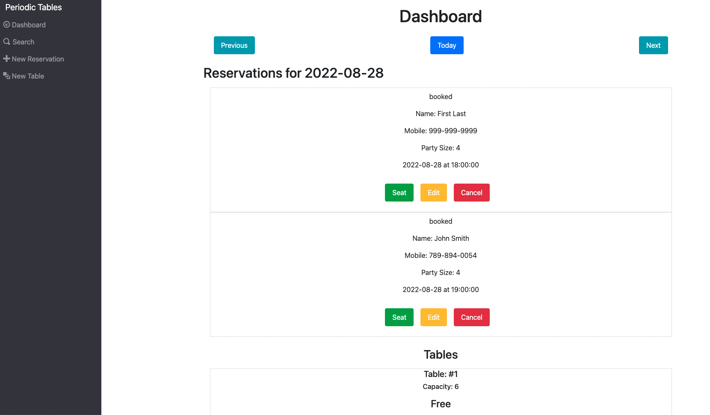

## `/search`

This page allows the user to search for a reservation by phone number either partial or full phone number then shows a list of matching reservations.

### `Before` Search screenshot

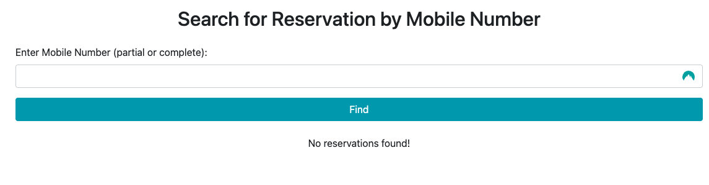

### `After` search screenshot

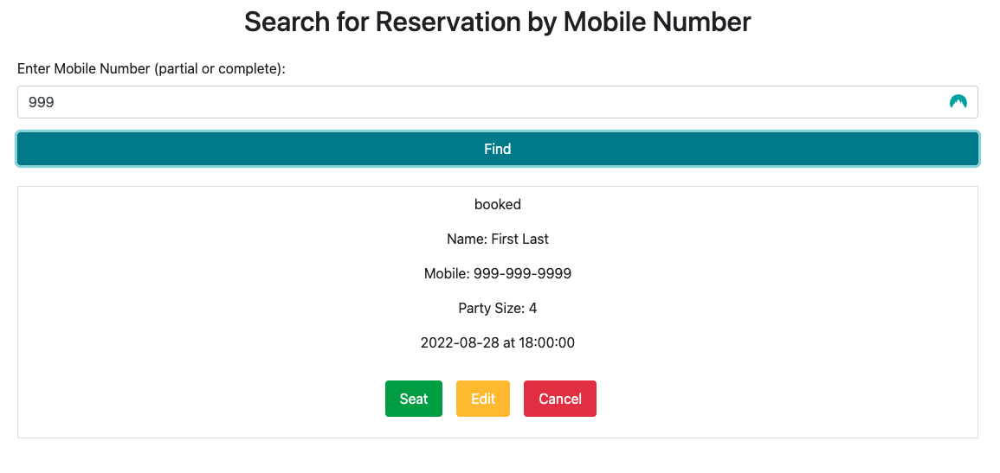

## `/reservations/new`

This route displays a form that allows the user to create a new reservation.

Once a new reservation has been submitted successfully it will redirect to the dashboard/`date of new reservation` displaying the new reservation and all other reservations for that date.

### `Before` Submit Screenshot

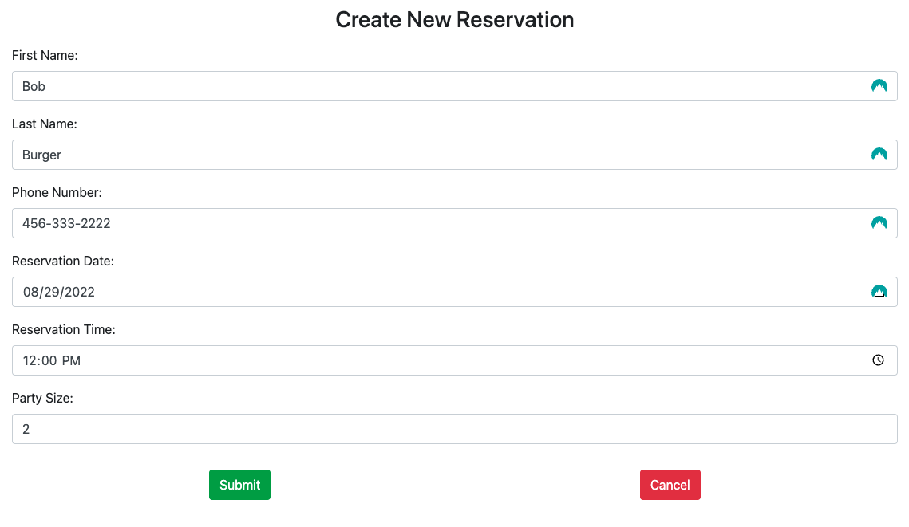

### `After` Submit screenshot

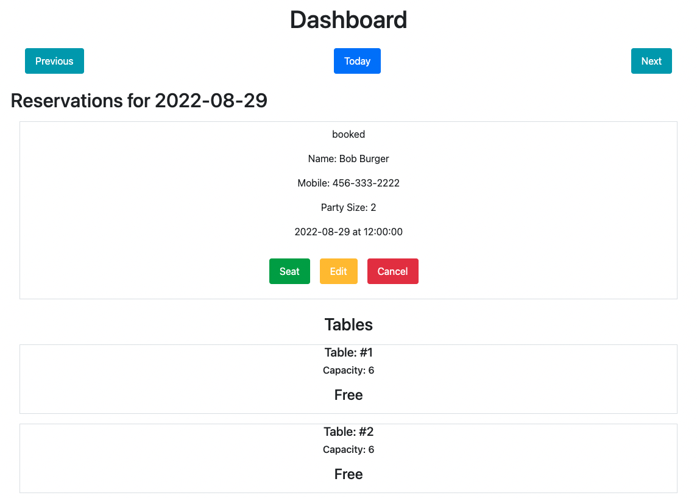

## `/reservations/:reservation_id/edit`

This route is called by clicking `edit` on an existing reservation that has the status `booked` (no other status can be edited). Once edit is clicked it goes to a form identical to the new reservation form but with current values filled in. When successfully submitted the form redirects to the dashboard/`date of reservation`.

### Dashboard `Edit Button` Screenshot

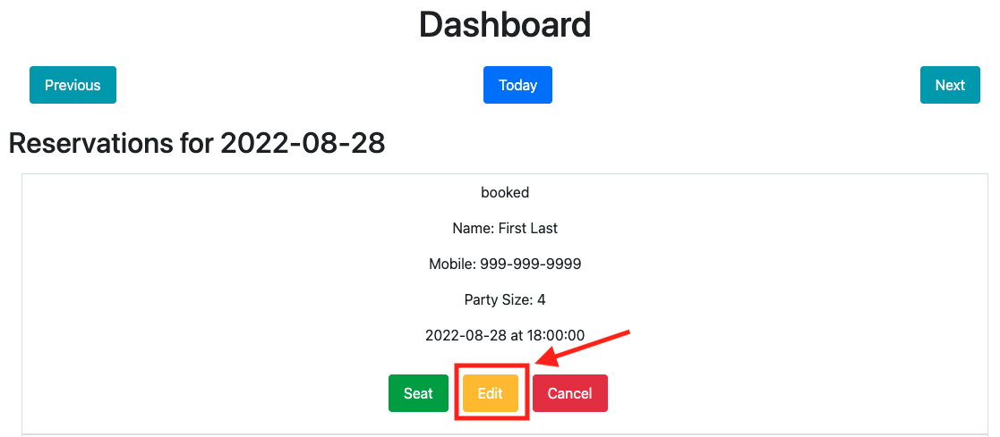

### `Before` Submit Screenshot

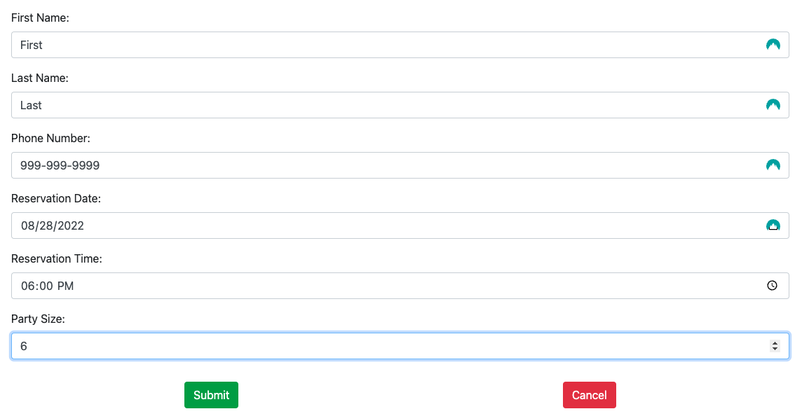

### `After` Submit Screenshot

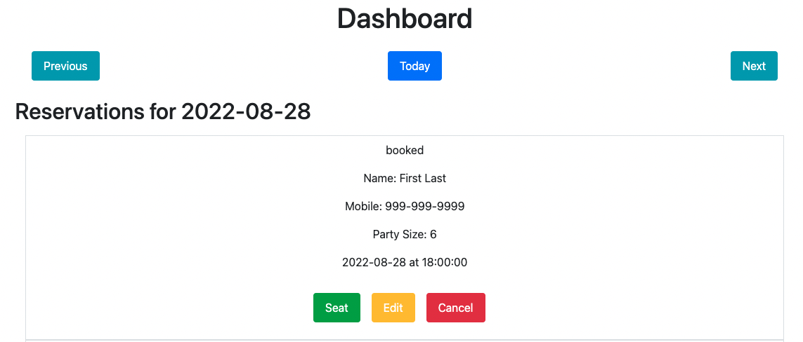

## `/reservations/:reservation_id/seat`

This route is called by clicking `seat` on an existing reservation that has the status `booked` (no other status can be seated). Displays a form to assign a reservation a table. After the form is successfully submitted it redirects to dashboard. After a table has been seated the table should show `Occupied` and display a `Finish` button that when clicked finishes the reservation (which hides the reservation) then changes table's status to `free`.

### Dashboard `Seat Button` screenshot

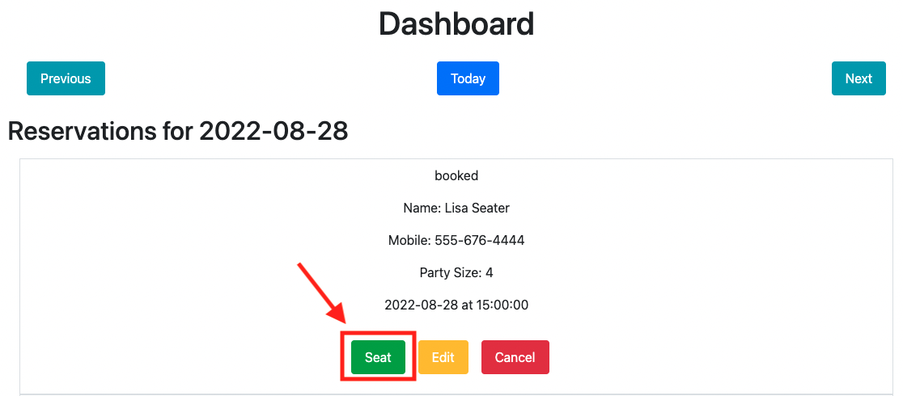

### `Before` Submit Screenshot

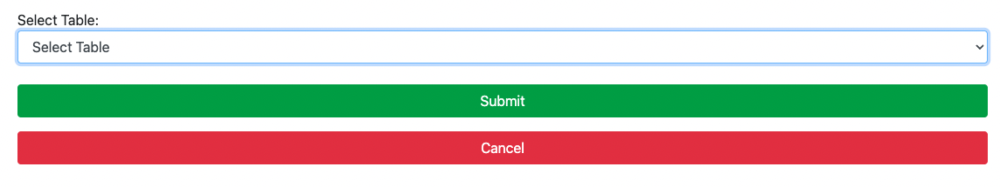

### `After` Submit Screenshot

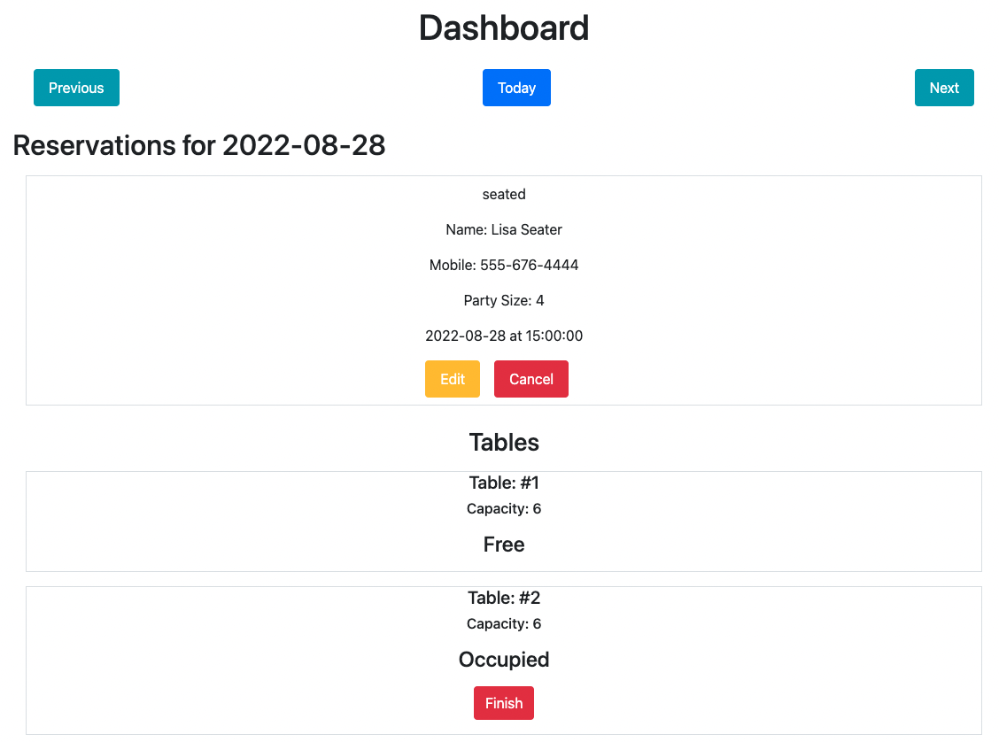

### `Finish Before button` Screenshot

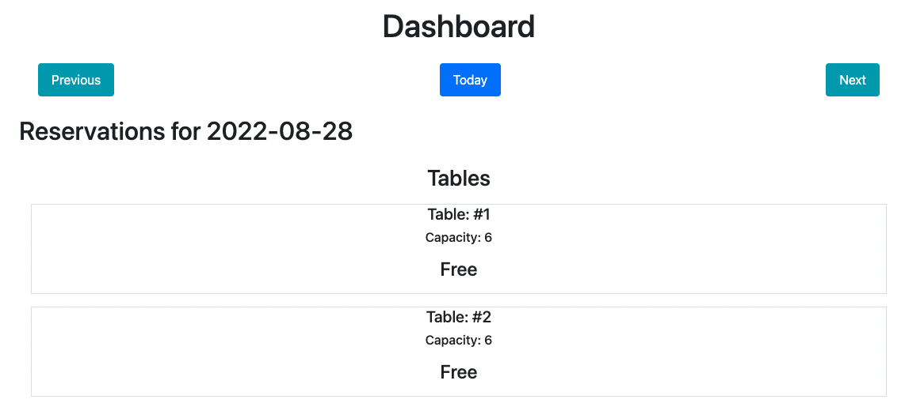

### `Finish After button` Screenshot


## `/tables/new`

This route displays a form to create a new table.

Once a new table has been submitted successfully it will redirect to the dashboard/`current-date` displaying the new table .

### `Before` submit Screenshot

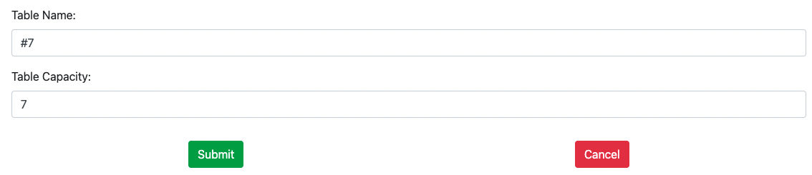

### `After` submit Screenshot

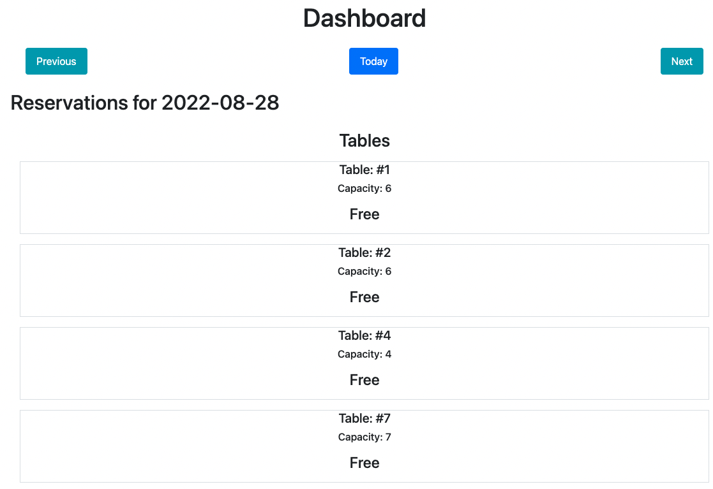


# Installation Instructions

Fork/clone the repo to start. Then navigate to the top level of the project in your terminal and execute:

1. `npm i`
2. `cd front-end && npm i`
3. `cd ../back-end && npm i`

Now that you have all of the scripts installed, you will need four (or less) different PostgreSQL database instances to either run the application locally or test it.

You must make a `.env` file in both the front-end and back-end directories.

1. `cp ./back-end/.env.sample ./back-end/.env`
2. `cp ./front-end/.env.sample ./front-end/.env`

Manually update the back-end `.env` file's environment variables with the values of your database URLs like so:

```
DATABASE_URL=production-data-base-url-goes-here
DATABASE_URL_DEVELOPMENT=development-data-base-url-goes-here
DATABASE_URL_TEST=test-data-base-url-goes-here
DATABASE_URL_PREVIEW=preview-data-base-url-goes-here
```

In the front-end `.env` file, enter:

```
REACT_APP_API_BASE_URL=http://localhost:5001
```

Now you will need to migrate the tables to the development database. Don't bother doing it for the test database, though. The tests are carrying that out for you each time. Cd into the back-end folder and run:

1. `npx knex migrate:latest`
2. `npx knex seed:run`

Now you are ready to run the server locally in development mode. From the top level of the project, run `npm run start:dev` if you would like to run the server and application.

If you would like to test the application, you can view the `package.json` files and use the testing scripts provided there. The tests that should run smoothly include:

1. all of those that are structured like `npm run test:5:backend` or `npm run test:3:frontend`, etc for numbers 1-8
2. `npm run test:frontend` and `npm run test:backend`
3. `npm run test` which should run all of the tests